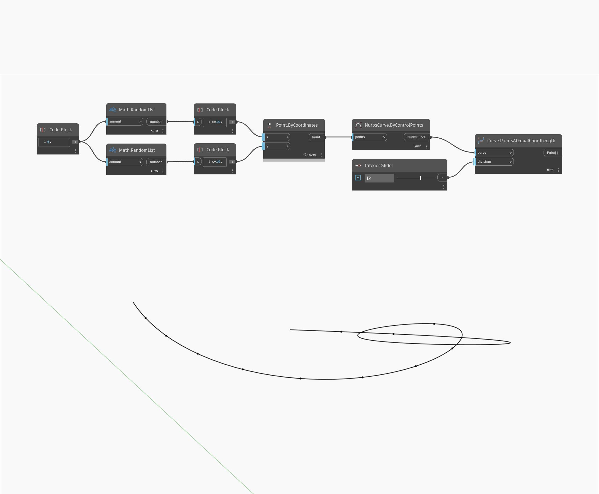

## Подробности
PointsAtEqualChordLength возвращает список точек на входной кривой путем деления кривой на равные прямолинейные хорды. Используемое количество делений вводится как целое число, что приводит к равномерному распределению имеющихся точек по кривой. Этот узел не включает конечные точки кривой. В примере ниже для создания списка точек используются два набора случайных чисел. Эти точки используются для создания NURBS-кривой по контрольным точкам. Для входного элемента divisions в узле PointsAtEqualChordLength используется числовой регулятор Integer.
___
## Файл примера

