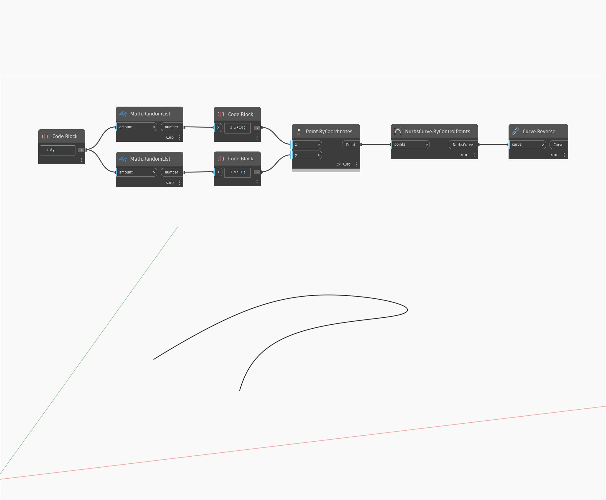

## Подробности
Reverse возвращает новый вектор, направленный в сторону, противоположную входным данным. В примере ниже вектор (1,0,1) возвращает вектор (-1,0,-1). При корректировке регулятора направления вектора меняются значения координат вектора и возвращается другой обратный вектор. Векторы представлены в виде линий.
___
## Файл примера

