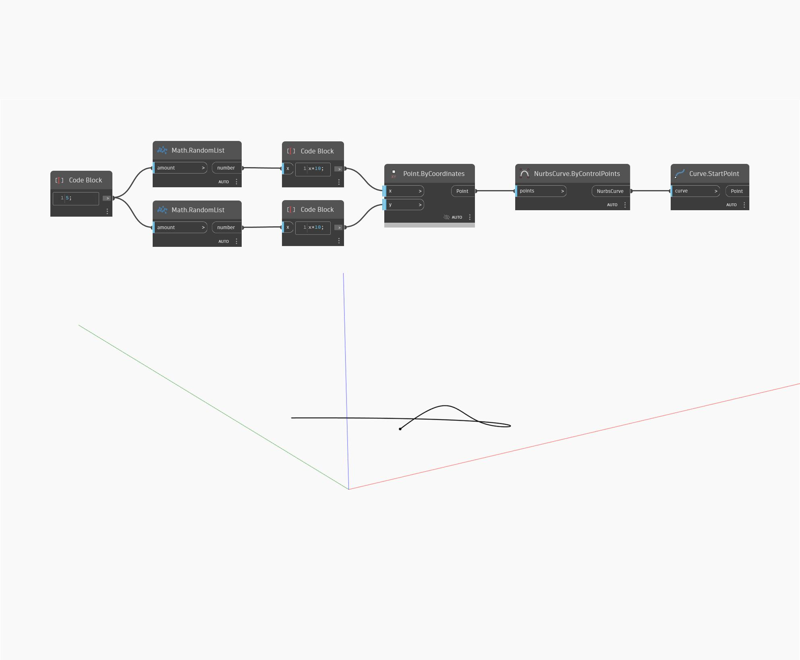

## Подробности
StartPoint возвращает начальную точку входной кривой. В примере ниже сначала создается NURBS-кривая с помощью узла ByControlPoints, где в качестве входных данных используется набор случайных точек. Определить начальную точку этой кривой можно с помощью узла StartPoint.
___
## Файл примера

