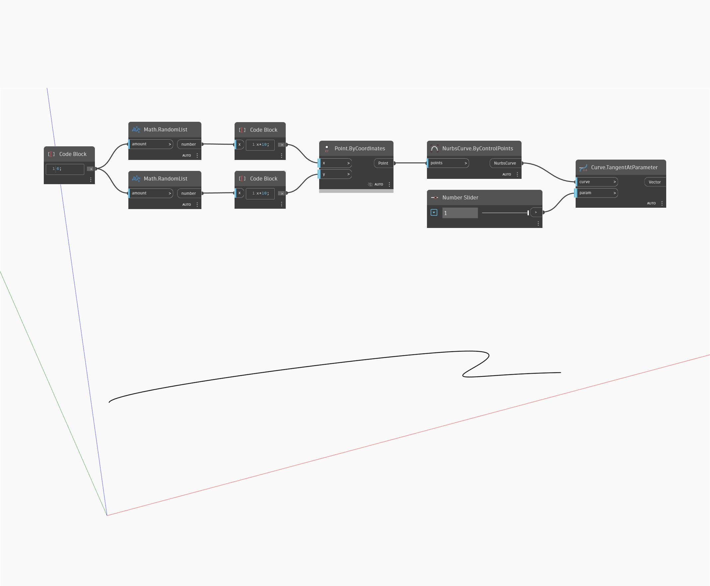

## Подробности
TangentAtParameter возвращает вектор, направление которого совпадает с направлением касательной, в заданном параметре кривой. Параметризация кривой измеряется в диапазоне от 0 до 1, при этом 0 представляет начало кривой, а 1 — ее конец. В примере ниже сначала с помощью узла ByControlPoints создается NURBS-кривая, где в качестве входных элементов используется набор случайных точек. Для управления входным элементом parameter узла TangentAtParameter используется числовой регулятор с диапазоном значений от 0 до 1.
___
## Файл примера

