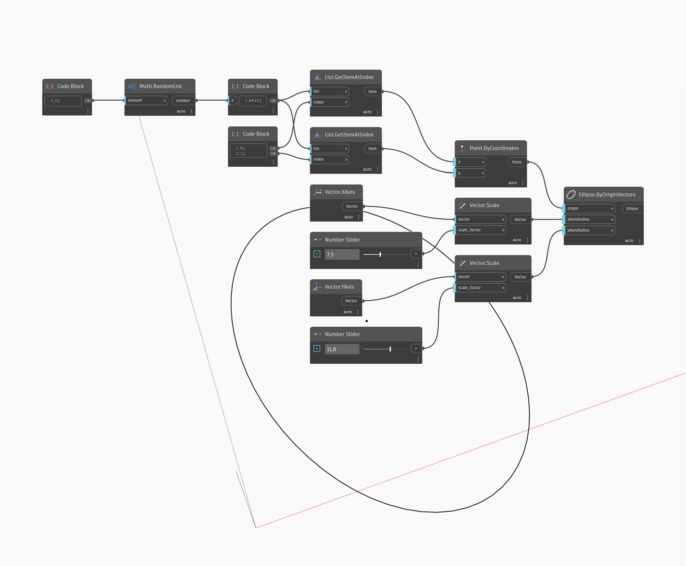

## Подробности
Ellipse.ByOriginVectors позволяет создать эллипс с центром во входных точках начала координат. В данном случае в качестве входных данных для XAxisRadius и YAxisRadius требуются векторы. Эти два вектора должны быть ортогональны (под прямым углом) друг другу. Векторы определяют плоскость эллипса. Им необязательно иметь направления, аналогичные направлениям X и Y МСК. В данном примере сначала создается точка начала координат путем генерирования двух случайных чисел. Затем используются единичные векторы X и Y, которые масштабируются с помощью числовых регуляторов.
___
## Файл примера

