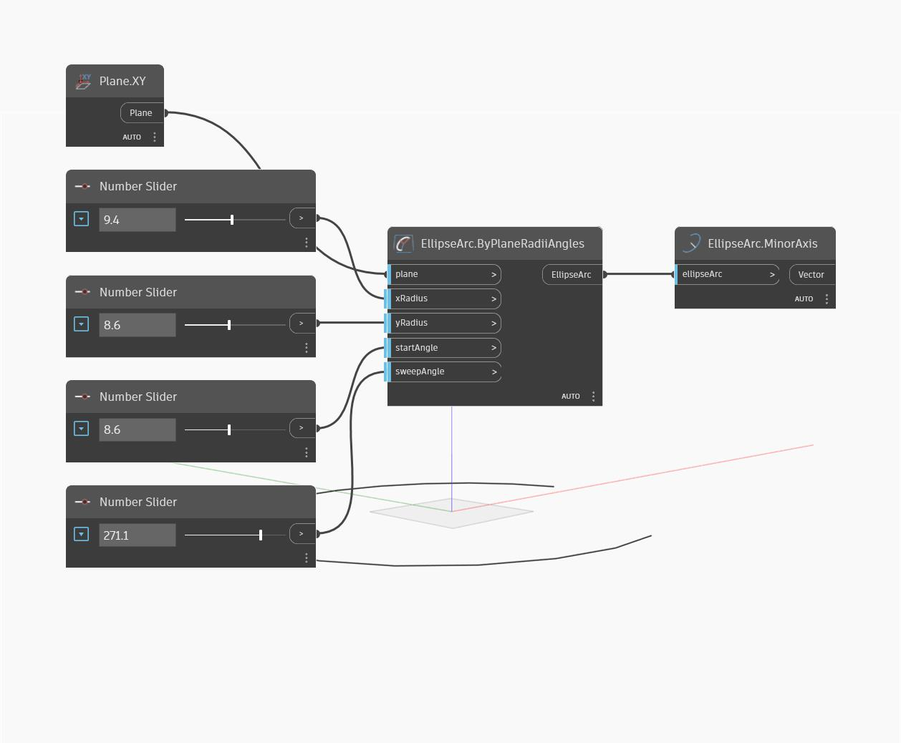

## Подробности
MinorAxis возвращает меньшую из двух осей эллипса. Ось выводится в виде вектора, величина которого равна меньшему из двух радиусов. Обратите внимание, что большая и малая оси определяются длиной, а не направлением. Таким образом, малая ось может соответствовать xAxisRadius одного эллипса и yAxisRadius другого. В данном примере сначала создается дуга эллипса с использованием плоскости XY и числовых регуляторов. Затем MinorAxis используется для извлечения малой оси эллипса.
___
## Файл примера

