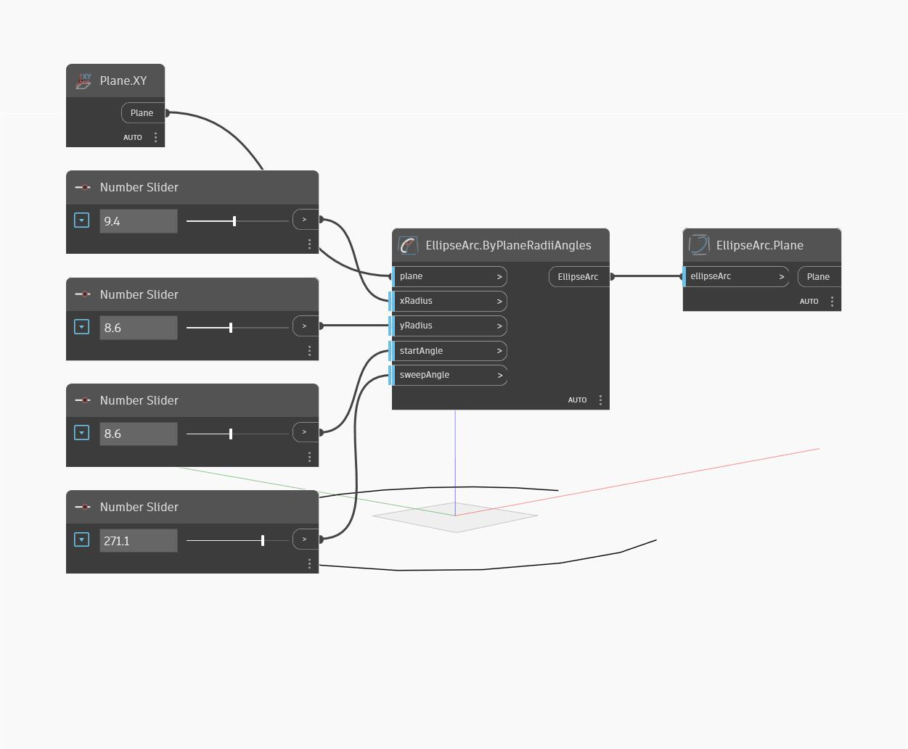

## Подробности
`EllipseArc.Plane` находит плоскость эллиптической дуги, которая совпадает с плоскостью завершенного эллипса.

В примере ниже сначала создается эллиптическая дуга с помощью плоскости XY и серии регуляторов чисел. Затем узел `EllipseArc.Plane` используется для извлечения плоскости эллипса.

___
## Файл примера

