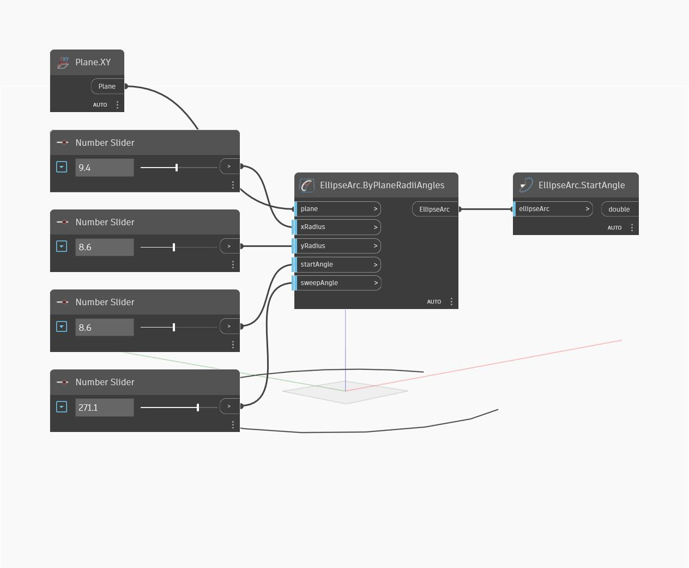

## Подробности
StartAngle позволяет определить начальный угол дуги эллипса. Он измеряется в градусах против часовой стрелки от плоскости оси X. В примере сначала создается дуга эллипса с помощью плоскости XY и последовательности числовых регуляторов. Затем с помощью функции StartAngle извлекается угол начальной точки эллипса.
___
## Файл примера

