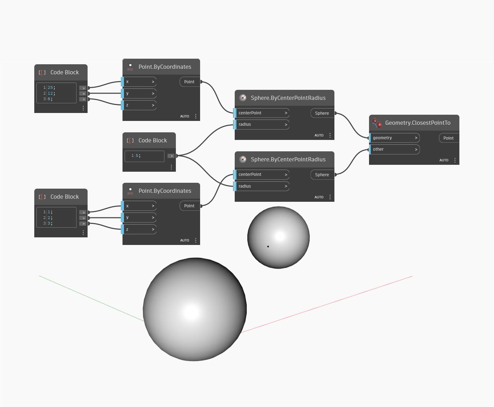

## Подробности
Geometry.ClosestPointTo позволяет найти точку на одной геометрии, ближайшую к другой геометрии, с добавлением в документ 3D-точки. В данном примере выполняется поиск точки на одной сфере, ближайшей к другой сфере.
___
## Файл примера

