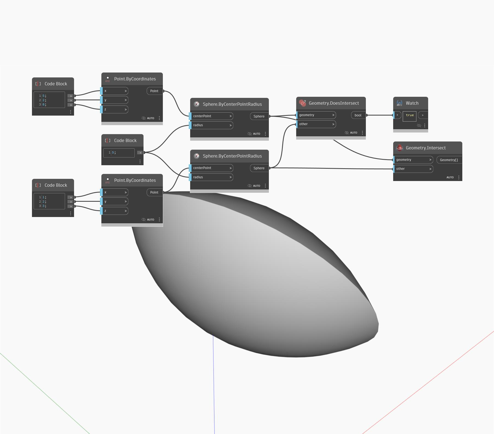

## Подробности
Geometry.Intersect позволяет найти пересекающуюся геометрию, общую для двух объектов геометрии. В данном примере при пересечении двух сфер возвращается сложная поверхность, также называемая пересечением тел.
___
## Файл примера

