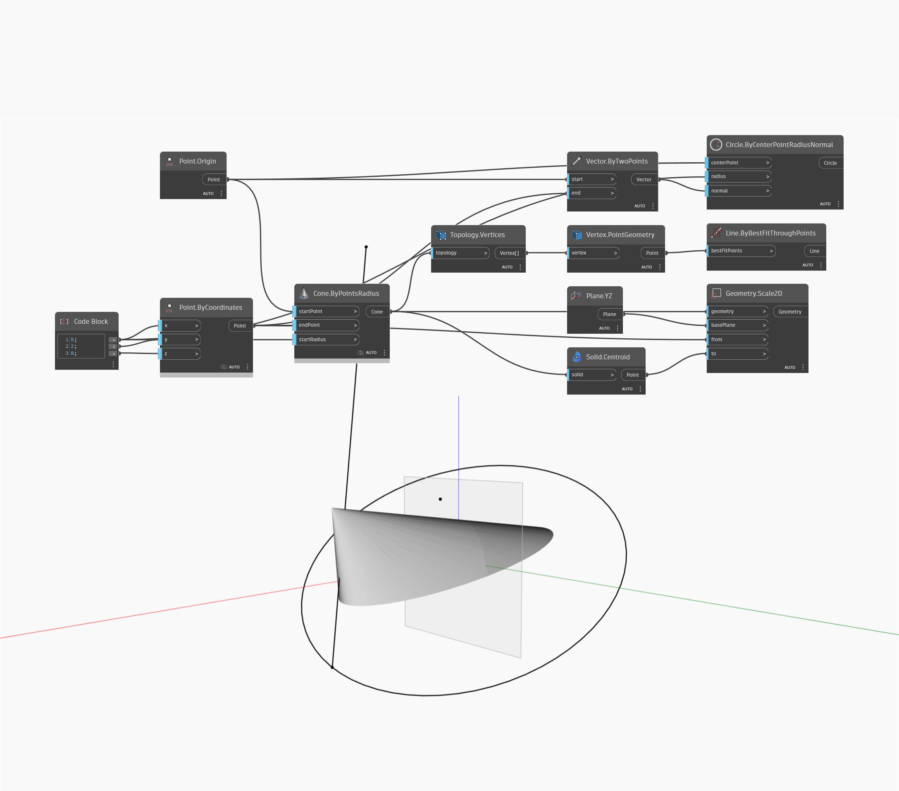

## Подробности
Geometry.Scale2D позволяет масштабировать геометрию в двух направлениях от базовой плоскости и двух опорных точек. В файле примера конус масштабируется от конечной точки к центроиду относительно плоскости YZ.
___
## Файл примера

