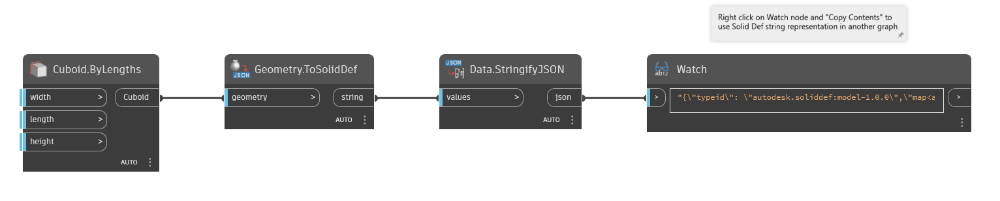

## Подробности
`Geometry.ToSolidDef` преобразует входную геометрию в файл JSON Solid Def. С помощью этого узла можно предоставить общий доступ к представлению геометрии в формате JSON вместо отправки файла.

В примере ниже кубоид преобразуется в Solid Def. Скопируйте содержимое узла Watch, чтобы использовать строковое представление Solid Def на другом графике.

___
## Файл примера

