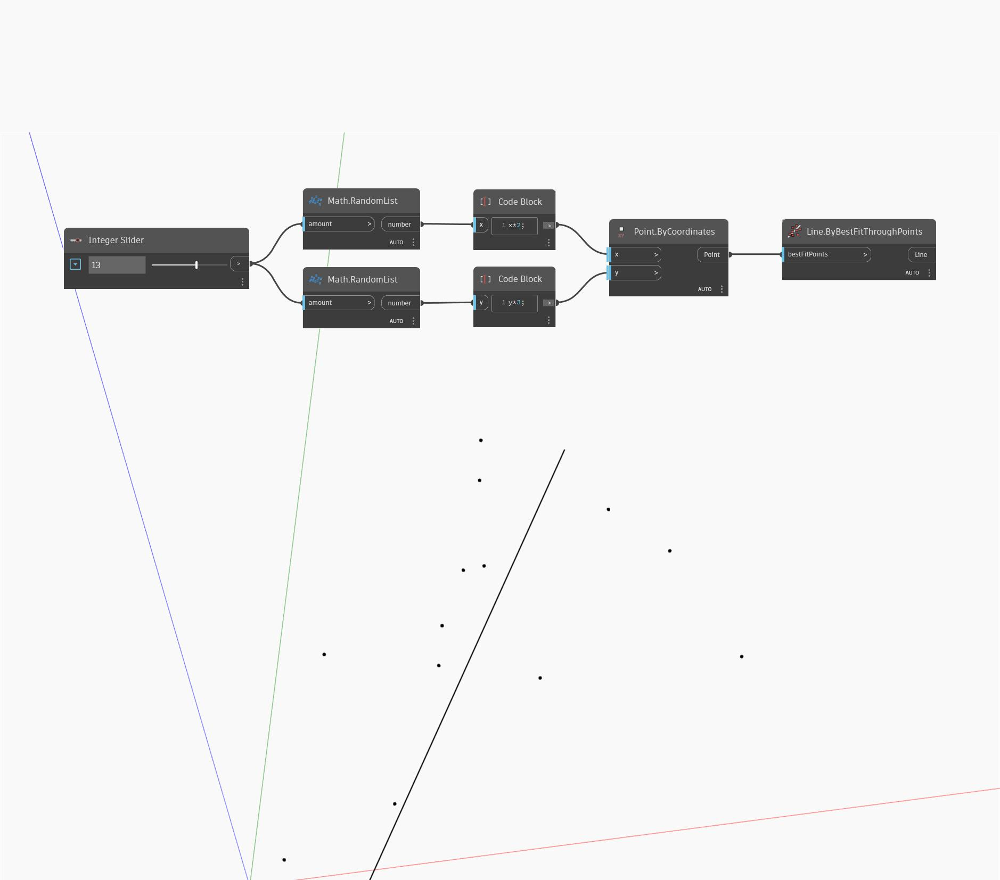

## Подробности
`Line.BestFitThroughPoints` создает линию, аппроксимируя график рассеяния точек. Входные данные представляют собой список точек.

В примере ниже мы используем регулятор чисел для управления количеством генерируемых случайных точек, а затем находим линию наилучшего вписывания через набор точек.

___
## Файл примера

