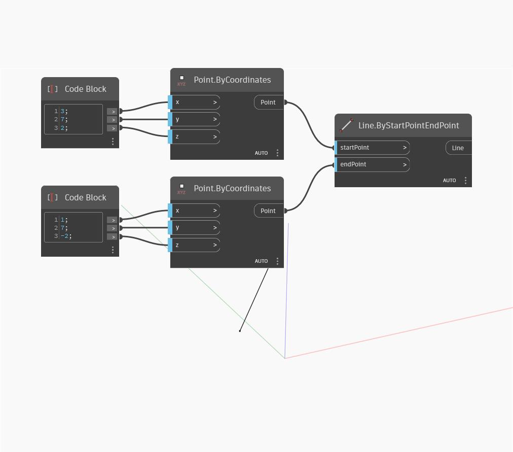

## Подробности
`Line.ByStartPointEndPoint` создает линию между двумя входными точками.

В примере ниже используется два блока кода для задания координат X, Y и Z двух точек, а затем создается прямая между двумя точками.

___
## Файл примера

