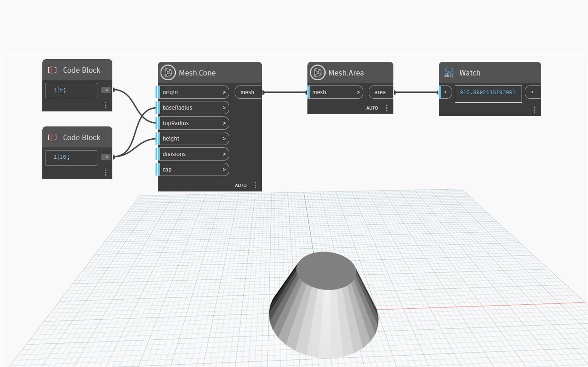

## Подробности
`Mesh.Area` возвращает площадь входной сети. В приведенном ниже примере с помощью узла `Mesh.Cone` создается конус, а затем с помощью `Mesh.Area` вычисляется площадь его сети.

## Файл примера

