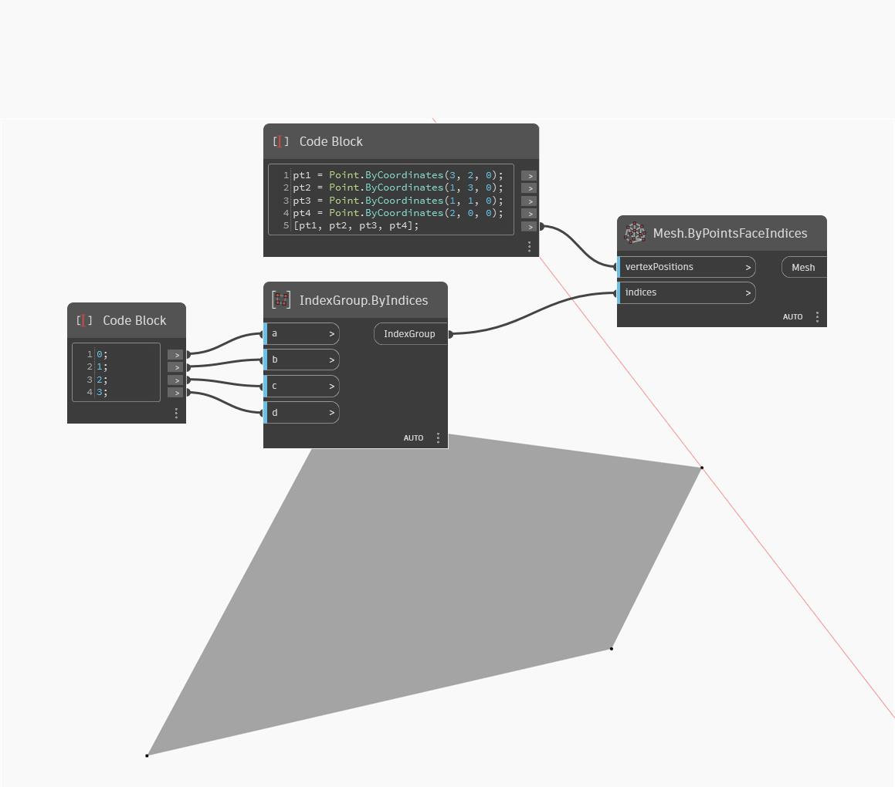

## Подробности
ByPointsFaceIndices возвращает сеть на основе входных вершин в виде точек и входных индексов. В примере ниже создается четырехсторонняя сеть с четырьмя точками и объектом IndexGroup из четырех индексов.
___
## Файл примера

