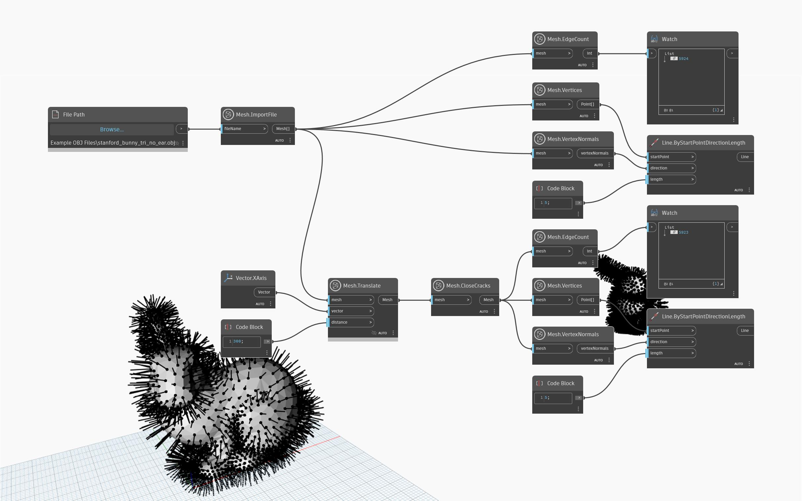

## Подробности
`Mesh.CloseCracks` закрывает трещины в сети путем удаления внутренних границ из объекта сети. Внутренние границы могут естественным образом возникнуть в результате операций моделирования сети. При выполнении этой операции и удалении вырожденных ребер могут быть удалены треугольники. В приведенном ниже примере узел `Mesh.CloseCracks` используется для импортированной сети. Для визуализации перекрывающихся вершин используется узел `Mesh.VertexNormals`. После того как для исходной сети используется узел Mesh.CloseCracks, уменьшается количество ребер, что также видно при сравнении количества ребер с помощью узла `Mesh.EdgeCount`.

## Файл примера

