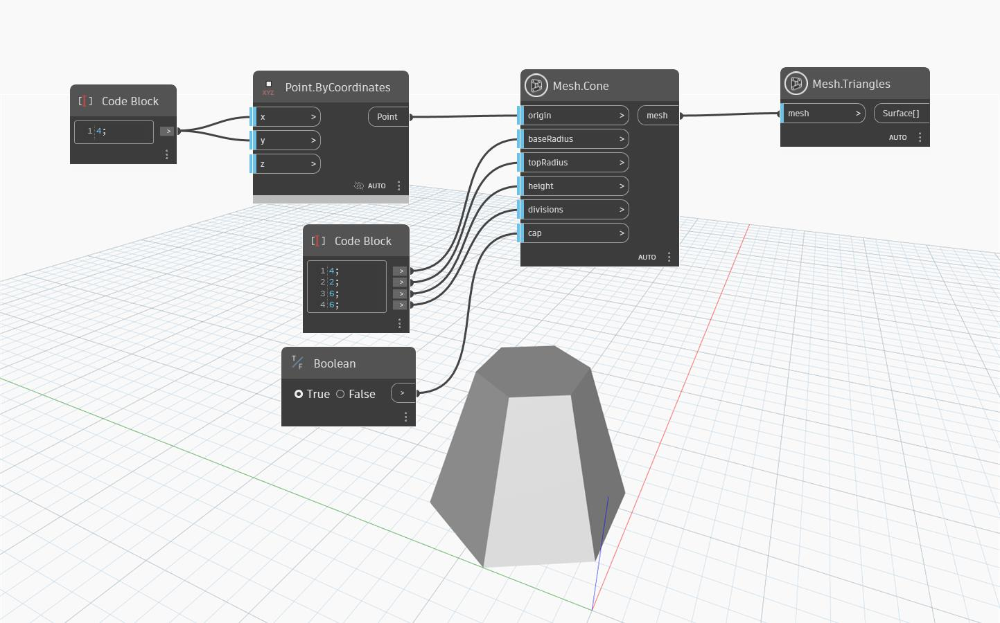

## Подробности
`Mesh.Cone` создает сеть-конус, основание которого центрировано во входной точке начала координат с учетом входного значения радиусов основания и верха, высоты и количества делений (`divisions`). Количество делений соответствует количеству вершин, создаваемых в верхней части и в основании конуса. Если количество делений равно 0, в Dynamo используется значение по умолчанию. Количество делений по оси Z всегда равно 5. Входной параметр `cap` использует узел `Boolean`, чтобы указать, будет ли конус замкнут в верхней части.
В приведенном ниже примере узел `Mesh.Cone` используется для создания сети в форме конуса с 6 делениями. Таким образом, основание и верх конуса являются шестиугольниками. Узел `Mesh.Triangles` используется для визуализации распределения треугольников сети.

## Файл примера

