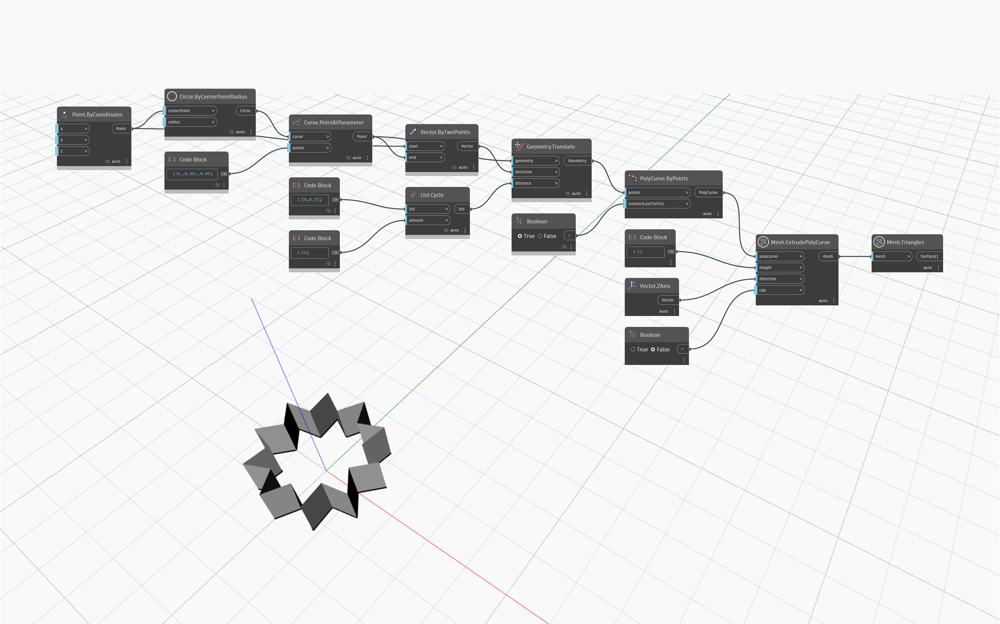

## Подробности
Узел `Mesh.ExtrudePolyCurve` выдавливает предоставленную сложную кривую (`polycurve`) на расстояние, заданное входным параметром `height`, в направлении вектора. Незамкнутые сложные кривые замыкаются путем соединения первой точки с последней. Если исходная сложная кривая плоская и не самопересекающаяся, получающаяся в результате сеть может быть замкнута для формирования сети твердого тела.
В приведенном ниже примере узел `Mesh.ExtrudePolyCurve` используется для создания замкнутой сети на основе замкнутой сложной кривой.

## Файл примера

