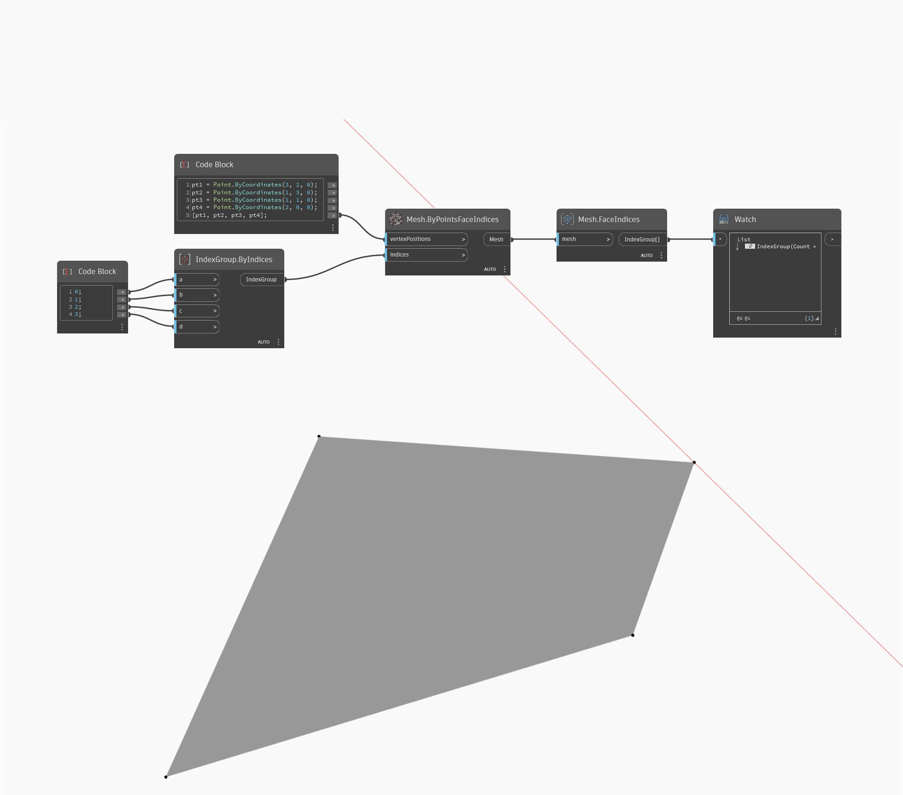

## Подробности
FaceIndices возвращает объект IndexGroup грани сетки в порядке против часовой стрелки. В примере ниже возвращается объект IndexGroup для грани четырехсторонней сети.
___
## Файл примера

