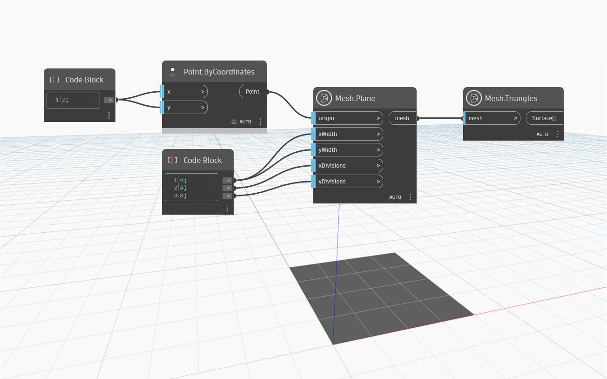

## Подробности
`Mesh.Plane` создает плоскую прямоугольную сеть с началом координат во входной точке, заданной шириной по осям X и Y и заданным количеством делений по осям X и Y. Если количество делений по осям X или Y равно 0, для любого из входных параметров будет использоваться значение по умолчанию (5).

В приведенном ниже примере узел `Mesh.Plane` используется для создания плоской сети с 4 линиями сетки по оси X и 8 линиями сетки по оси Y. Для визуализации распределения треугольников сети используется узел `Mesh.Triangles`.

## Файл примера

