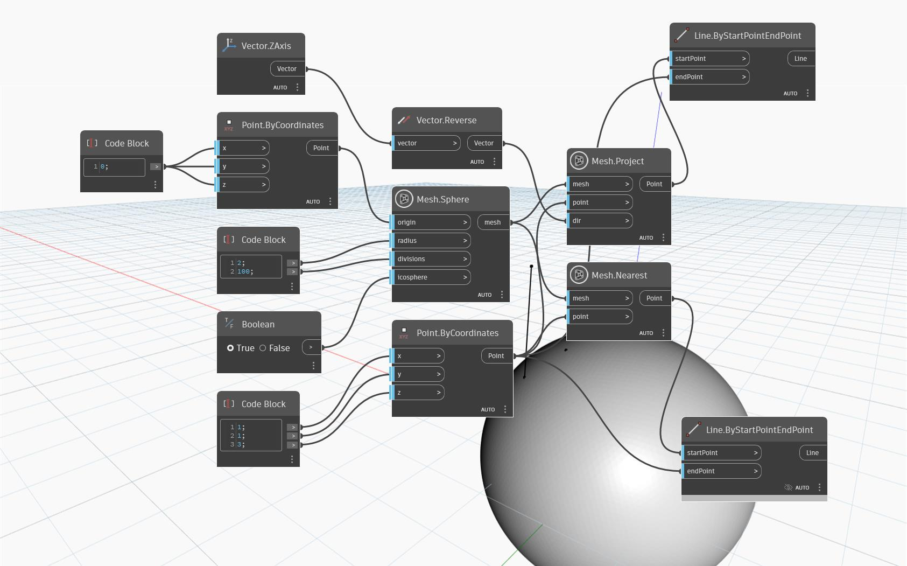

## Подробности
`Mesh.Project` возвращает точку на входной сети, которая является проекцией входной точки на сеть в направлении заданного вектора. Для корректной работы узла линия, проведенная от входной точки в направлении входного вектора, должна пересекаться с предоставленной сетью.

На графике в примере показан простой вариант использования узла. Входная точка находится выше сферической сети, но не прямо над ней. Точка проецируется в направлении отрицательного вектора оси Z. Полученная точка проецируется на сферу и отображается прямо под входной точкой. В отличие от выходных данных узла `Mesh.Nearest` (использующего ту же точку и сеть в качестве входных данных), полученная точка лежит на сети вдоль вектора нормали, проходящего через входную (ближайшую) точку. Для отображения «траектории» спроецированной точки на сеть используется узел `Line.ByStartAndEndPoint`.

## Файл примера

