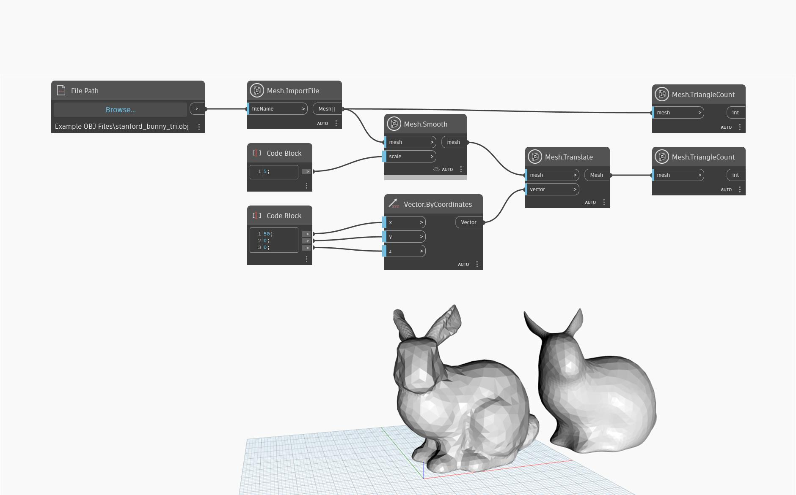

## Подробности
Этот узел возвращает новую гладкую сеть за счет использования алгоритма котангенциального сглаживания, который не раздвигает вершины от исходного положения и лучше сохраняет элементы и ребра. Чтобы задать пространственный масштаб сглаживания, в узле необходимо указать значение масштабирования в диапазоне от 0,1 до 64,0. Чем больше значения, тем сильнее сглаживание, из-за чего сеть кажется более простой. Несмотря на то, что новая сеть выглядит более гладкой и простой, она имеет то же количество треугольников, ребер и вершин, что и исходная.

В приведенном ниже примере объект импортируется с помощью `Mesh.ImportFile`, а затем сглаживается с помощью `Mesh.Smooth` со значением сглаживания 5. После этого объект перемещается в другое положение с помощью `Mesh.Translate` для удобства предварительного просмотра, а также используется `Mesh.TriangleCount` для отслеживания количества треугольников в старой и новой сетях.

## Файл примера

