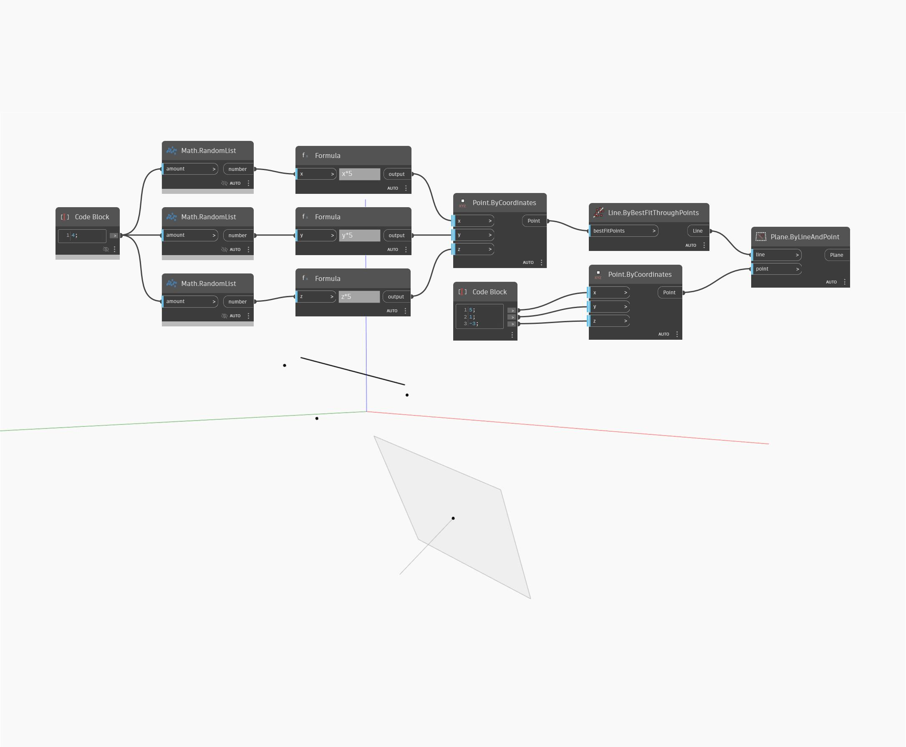

## Подробности
Узел Plane.ByLineAndPoint позволяет создать плоскость, начало координат которой определяется входной точкой, а расположение — входной линией. Точка не должна лежать на оси линии. В примере линия создается путем использования набора случайных точек с последующим использованием узла ByBestFitThroughPoints. Точка начала координат создается с помощью блока кода, в котором задаются координаты x, y и z для компонента Point.ByCoordinates. Затем линия и точка используются в качестве входных элементов для создания плоскости по прямой и точке.
___
## Файл примера

