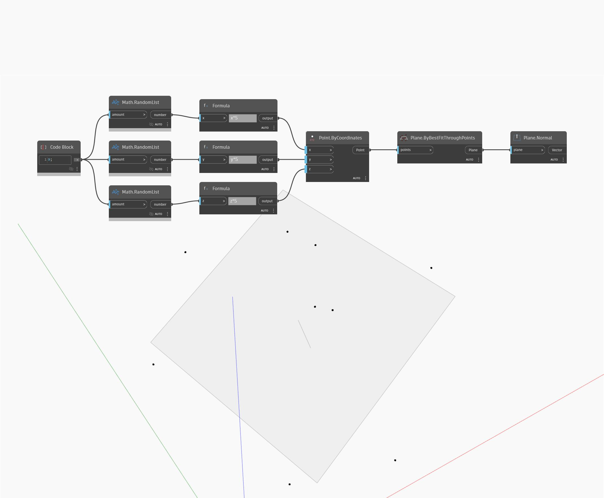

## Подробности
Plane.Normal позволяет определить вектор нормали входной плоскости. Он также равен произведению XAxis и YAxis плоскости. В примере ниже сначала с помощью набора случайных точек создается оптимально вписанная плоскость через точки. Затем можно найти вектор нормали этой плоскости.
___
## Файл примера

