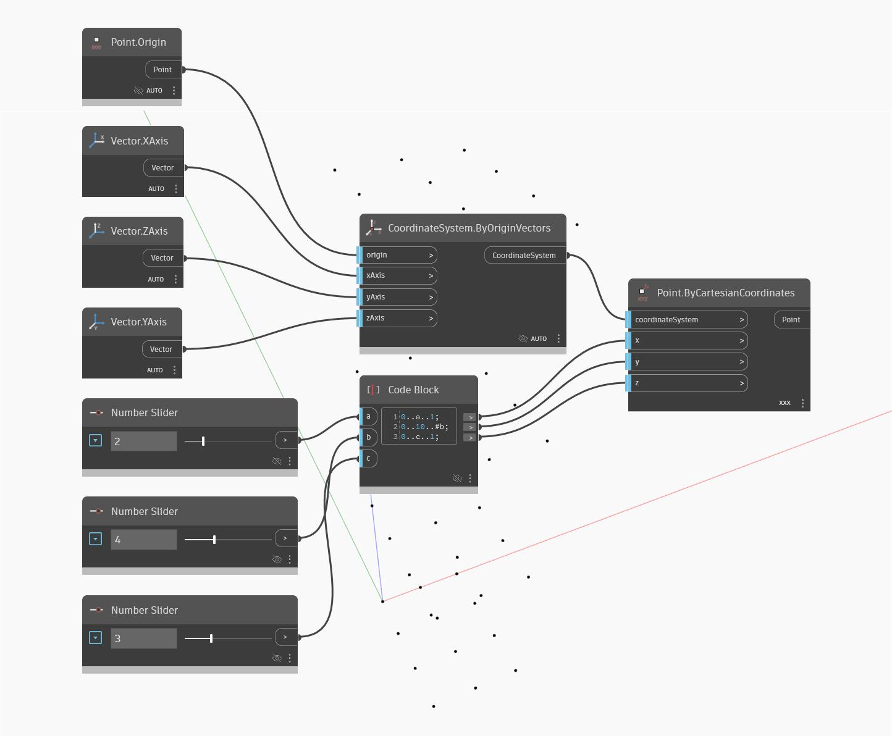

## Подробности
Point.ByCartesianCoordinates позволяет задать значения X, Y и Z положения точки. В данном примере задаются несколько диапазонов в узлах Code Block, управляемых регуляторами, для создания трехмерного массива точек.
___
## Файл примера

