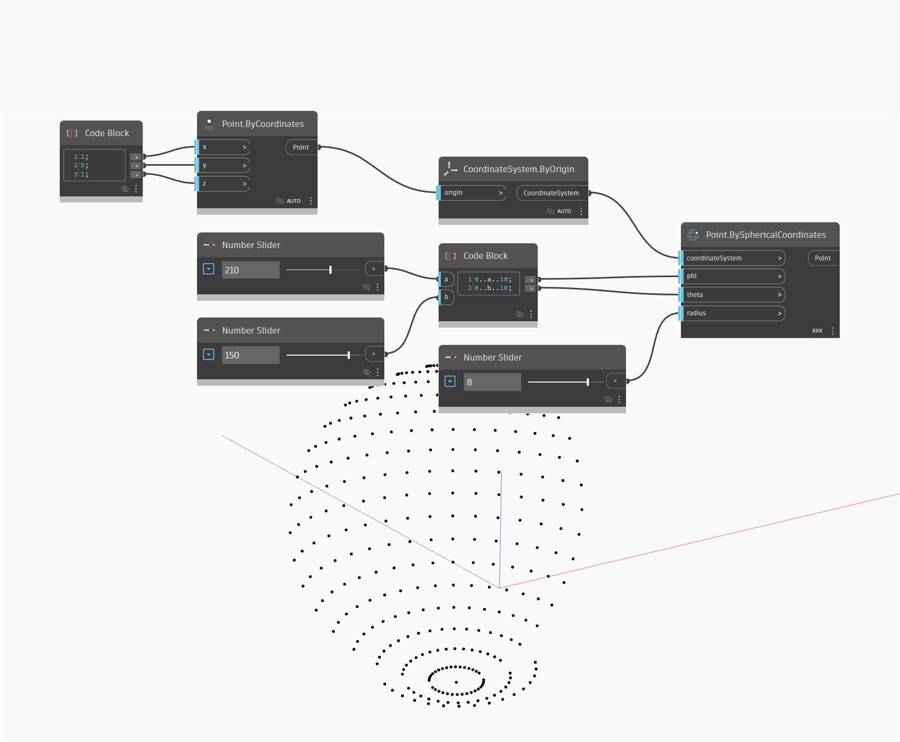

## Подробности
Узел Point.BySphericalCoordinates позволяет создать точку, расположенную в сферическом пространстве. Здесь в качестве параметра переплетения задается перекрестная ссылка, а для создания сетки точек вдоль цилиндра с динамическим радиусом используется диапазон углов фи и тета. Местоположение сферы задается в системе координат с началом в точке (1, 5, 1).
___
## Файл примера

