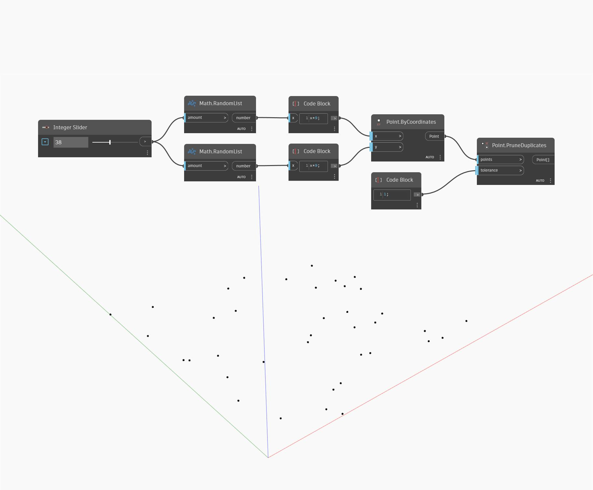

## Подробности
PruneDuplicates принимает в качестве входного элемента список точек, а возвращает список, из которого удалены повторяющиеся точки. Входное значение допуска используется для определения минимального расстояния, на котором должны находиться две точки для того, чтобы считаться повторяющимися. Если расстояние между двумя точками меньше допуска, первая точка в списке сохраняется, а вторая удаляется. В примере создается набор случайных точек. Затем узел PruneDuplicates с допуском, равным единице, используется для удаления всех точек, которые находятся на расстоянии меньше одной единицы измерения от другой точки.
___
## Файл примера

