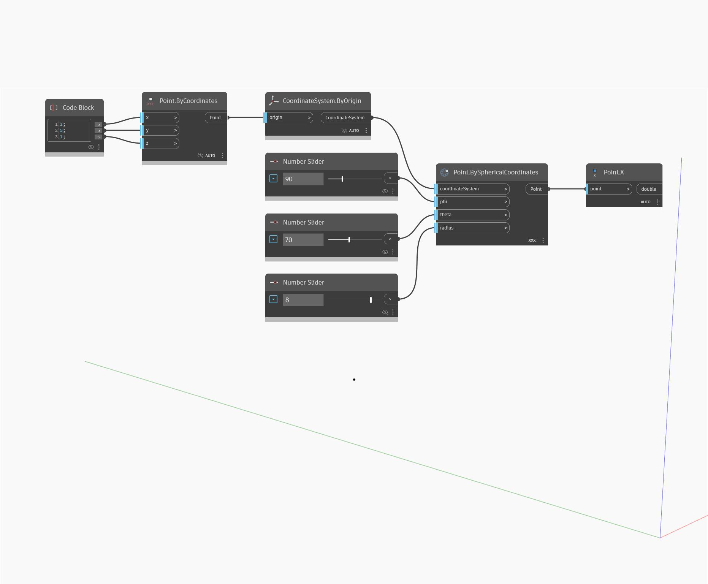

## Подробности
`Point.X` возвращает значение Х мирового пространства для входной точки.

В примере ниже используется узел `Point.BySphericalCoordinates` для создания точки, а затем — узел `Point.X` для возврата координаты X.

___
## Файл примера

