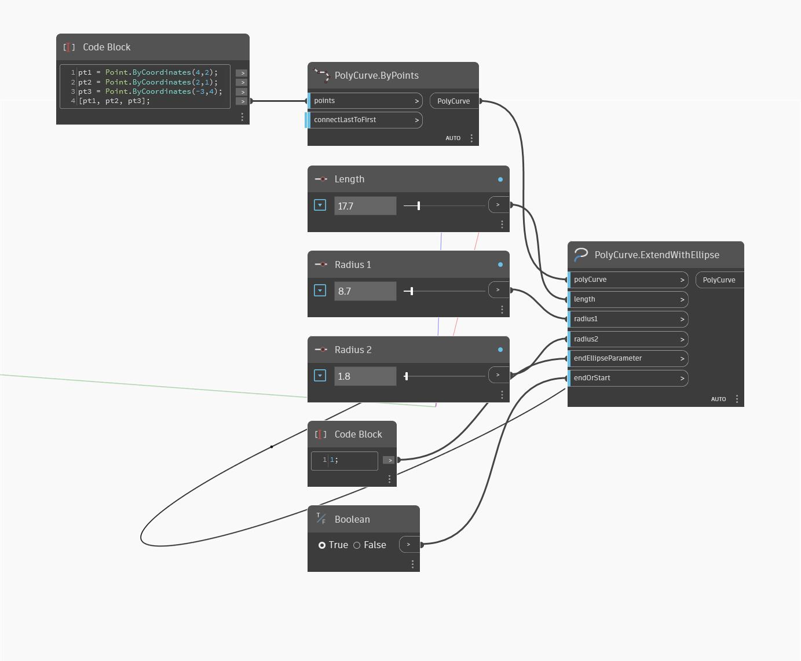

## Подробности
ExtendWithEllipse возвращает удлинение объекта PolyCurve в виде части эллипса. В примере ниже объект PolyCurve с одним сегментом удлиняется до эллипса. Удлинение контролируется двумя радиусами, длиной, конечным параметром и тем, какая сторона объекта PolyCurve удлиняется — начало или конец.
___
## Файл примера

