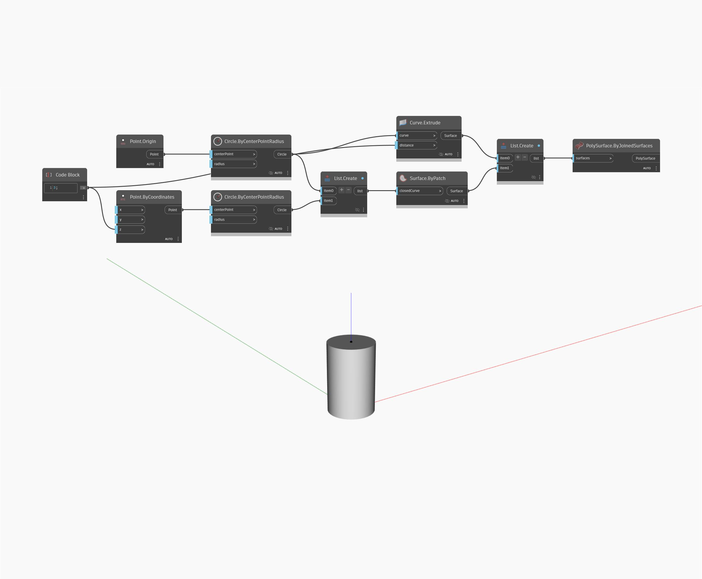

## Подробности
`PolySurface.ByJoinedSurfaces` возвращает новый объект PolySurface, объединенный из списка поверхностей.

В примере ниже два фрагмента поверхности и элемент выдавливания объединены в объект PolySurface, похожий на цилиндр.

___
## Файл примера

