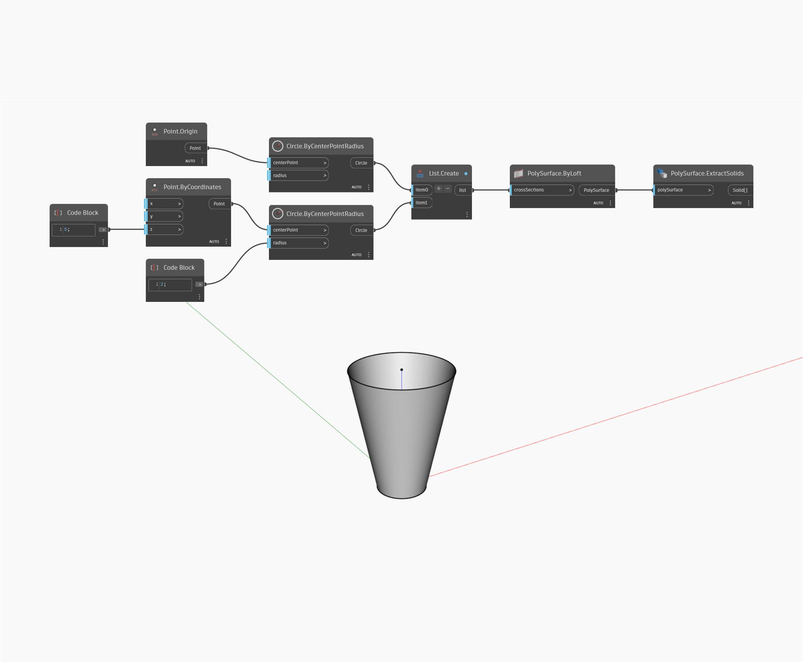

## Подробности
ExtractSolids возвращает объект Solid из коллекции объектов PolySurface. В примере ниже объект Solid возвращается из коллекции из трех поверхностей, образующих цилиндр. Поскольку узел принимает в качестве входного значения один объект PolySurface, прежде чем возвращать объект Solid, три поверхности необходимо объединить.
___
## Файл примера

