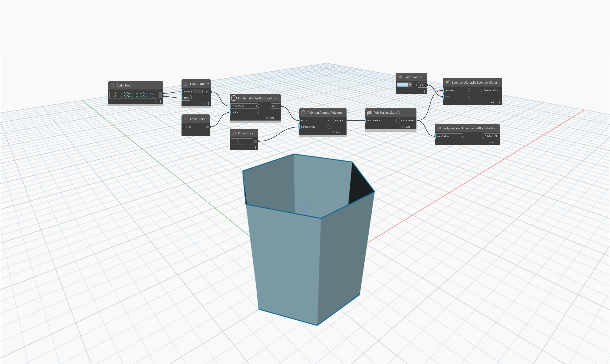

## Подробности
`PolySurface.UnconnectedBoundaries` возвращает объекты PolyCurve, которые представляют незамкнутые границы.

В примере ниже узел `PolySurface.UnconnectedBoundaries` возвращает верхнюю и нижнюю границы выдавленного шестиугольника в виде объектов PolyCurve, так как они не соединены.

___
## Файл примера

