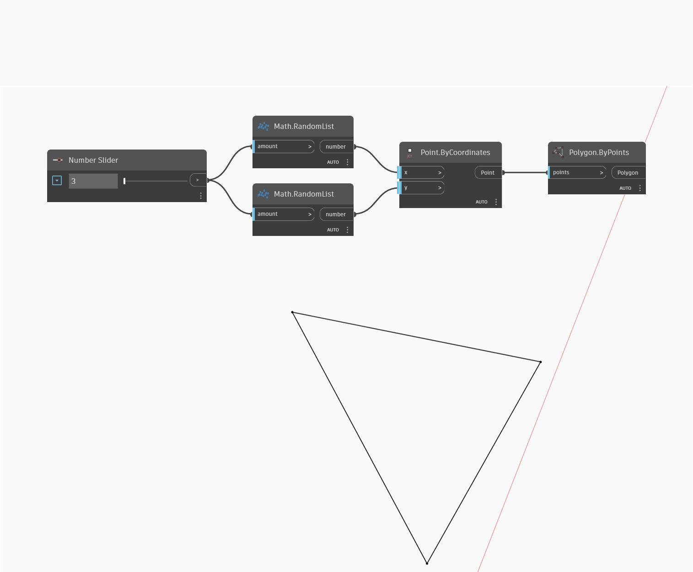

## Подробности
`Polygon.ByPoints` создает полигон из списка входных точек. Точки будут соединены в порядке, в котором они находятся в списке.

В примере ниже создается список случайных точек, управляемых с помощью регулятора чисел. Затем используется узел `Polygon.ByPoints` для соединения точек линиями.

___
## Файл примера

