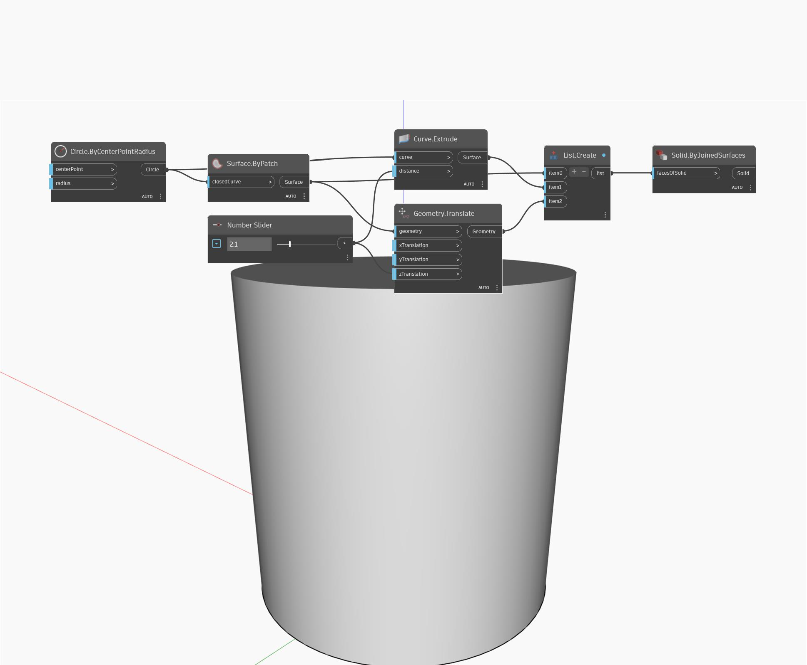

## Подробности
Solid.ByJoinedSurfaces принимает в качестве входного элемента список поверхностей, а возвращает отдельное тело, заданное поверхностями. Поверхности должны задавать замкнутую поверхность. В примере ниже в качестве базового объекта геометрии используется окружность. Окружность замыкается для создания поверхности, которая переносится в направлении Z. Затем путем выдавливания окружности создаются стороны. Узел List.Create используется для создания списка, состоящего из базовой, боковой и верхней поверхностей. После этого с помощью узла ByJoinedSurfaces список превращается в отдельное замкнутое тело.
___
## Файл примера

