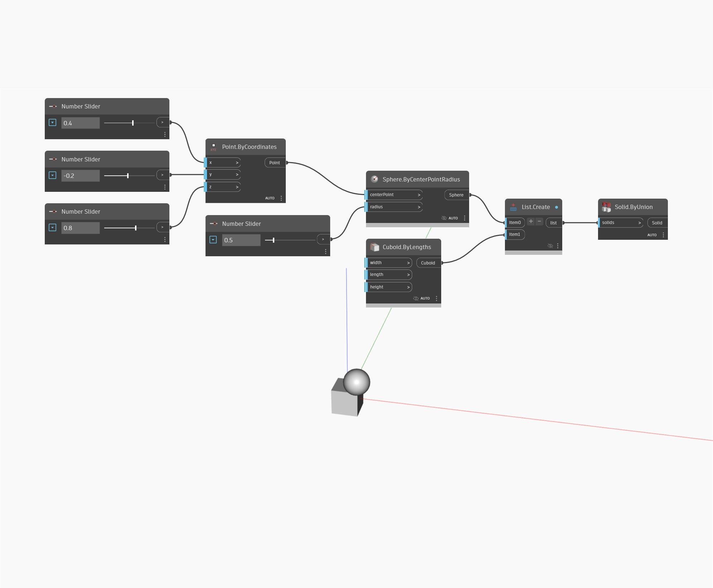

## Подробности
Solid.ByUnion позволяет создать одно новое тело путем объединения списка замкнутых тел. Объединение представляет собой комбинацию обоих тел, и новое тело будет включать в себя весь объем исходных тел. В примере ниже для управления положением и радиусом сферы используются числовые регуляторы. Кроме того, используется стандартный кубоид. Для размещения куба и сферы в одном списке, который будет использоваться в качестве входного элемента для узла Solid.ByUnion, применяется узел List.Create.
___
## Файл примера

