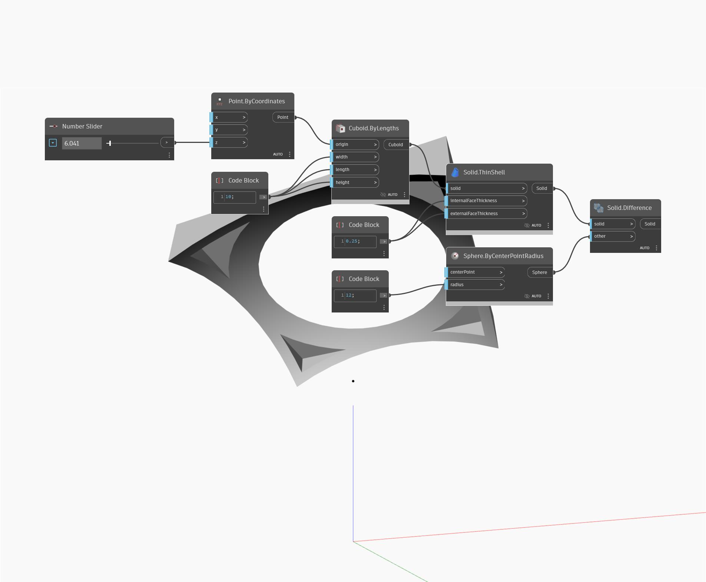

## Подробности
ThinShell позволяет создать новое тело путем смещения поверхностей, составляющих входное тело. Это также можно рассматривать как утолщение поверхностей входного тела. В примере ниже в качестве входного тела используется куб с фасками. Для управления внутренней и внешней толщиной граней оболочки используются два числовых регулятора.
___
## Файл примера

