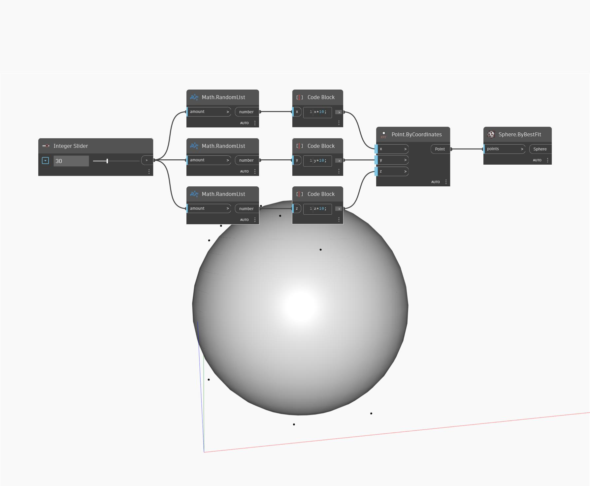

## Подробности
Sphere.ByBestFit позволяет создать сферу на основе списка точек, используемого в качестве входного элемента. Сфера будет создана с целью минимизации среднего расстояния от списка точек до поверхности сферы. В примере ниже создается набор случайных чисел, которые будут использоваться в качестве координат x,y и z для списка точек. Количество точек определяется с помощью целочисленного регулятора. Список точек используется в качестве входного элемента для узла Sphere.ByBestFit.
___
## Файл примера

