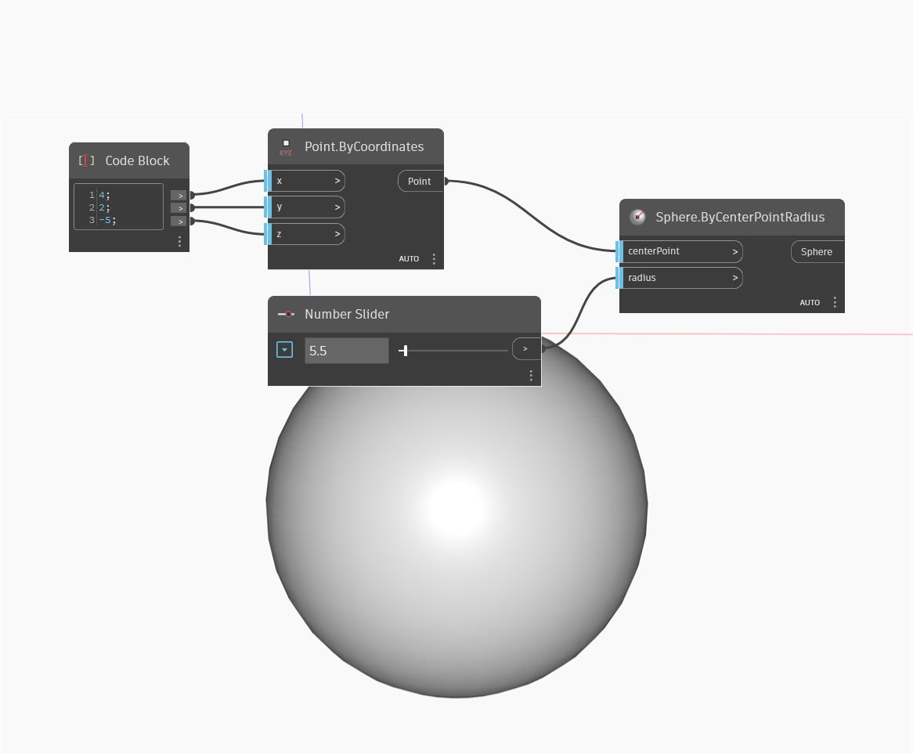

## Подробности
Sphere.ByCenterPointRadius позволяет создать сферу с входным радиусом и центром во входной точке. В примере ниже для задания координат точки, создаваемой по координатам, используется блок кода. Для определения радиуса сферы используется числовой регулятор.
___
## Файл примера

