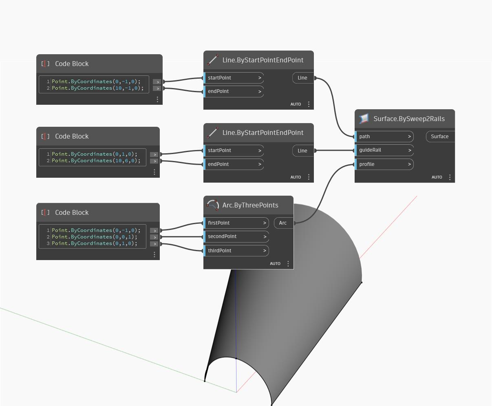

## Подробности
Surface.BySweep2Rails принимает входную кривую и использует две направляющие кривые для сдвига кривой профиля. В примере ниже в качестве входного профиля используется полукруг. Создаются две расходящиеся линии, используемые в качестве направляющих кривых для узла BySweep2Rails. Результат представляет собой поверхность с профилем в виде полукруга, который увеличивается по мере перемещения дуги вдоль расходящихся линий.
___
## Файл примера

