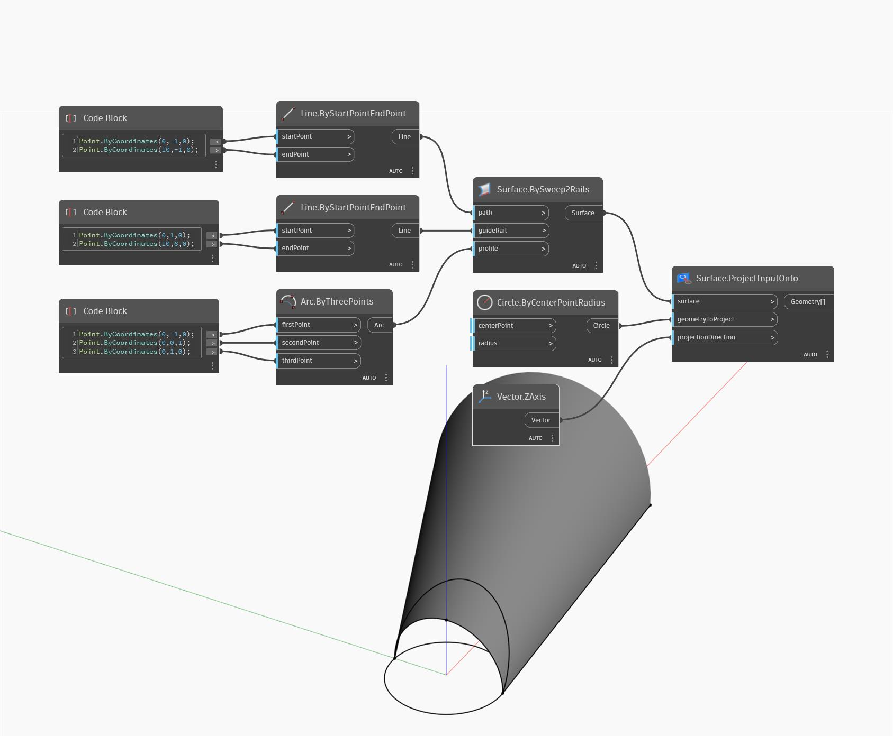

## Подробности
ProjectInputOnto позволяет спроецировать входной объект геометрии на заданную поверхность вдоль заданного направления. В примере ниже сначала с помощью узла BySweep2Rails создается поверхность, на которую будет выполняться проецирование. В начале координат строится окружность, которая будет использоваться в качестве проецируемого объекта геометрии. В качестве направляющего вектора проекции используется направление Z МСК. Результат представляет собой проекцию окружности на поверхность.
___
## Файл примера

