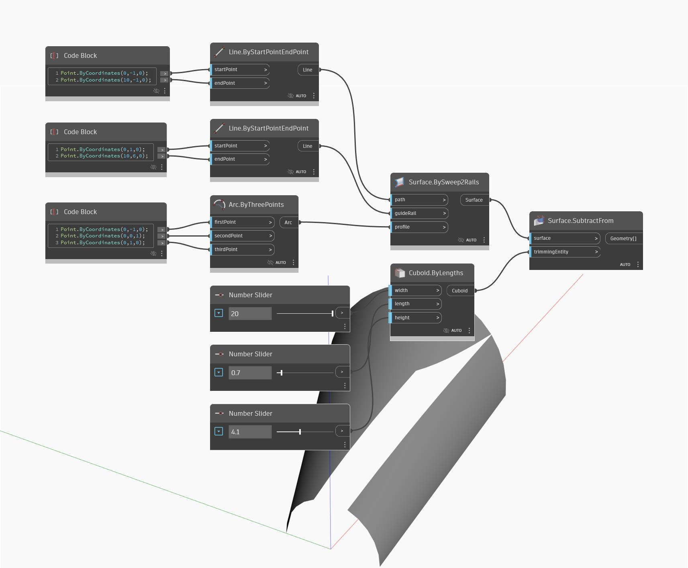

## Подробности
SubtractFrom позволяет создать новую поверхность путем вычитания входной геометрии обрезки из входной поверхности. В примере ниже сначала создается поверхность с помощью узла BySweep2Rails. Затем с помощью числовых регуляторов задаются значения длины, ширины и высоты кубоида. С помощью SubtractFrom можно обрезать поверхность путем вычитания области, пересекающейся с кубоидом.
___
## Файл примера

