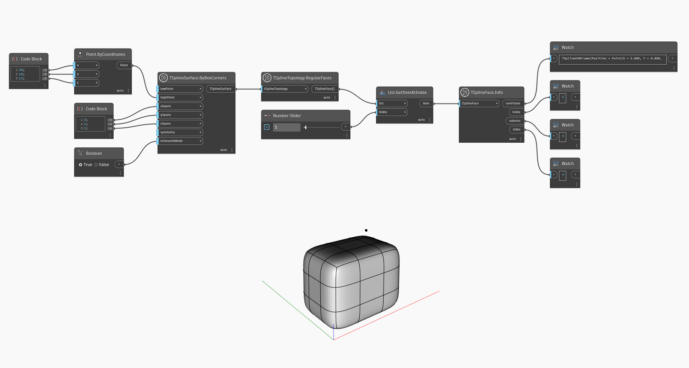

## In-Depth
Узел `TSplineFace.Info` возвращает следующие свойства грани Т-сплайна:
— `uvnFrame`: точка на выпуклой оболочке, вектор U, вектор V и вектор нормали грани Т-сплайна;
— `index`: индекс грани;
— `valence`: количество вершин или ребер, образующих грань;
— `sides`: количество ребер каждой грани Т-сплайна.

В приведенном ниже примере для создания Т-сплайна и выбора его граней используются узлы `TSplineSurface.ByBoxCorners` и `TSplineTopology.RegularFaces` соответственно. Узел `List.GetItemAtIndex` используется для выбора конкретной грани T-сплайна, а `TSplineFace.Info` — для выявления ее свойств.

## Файл примера

