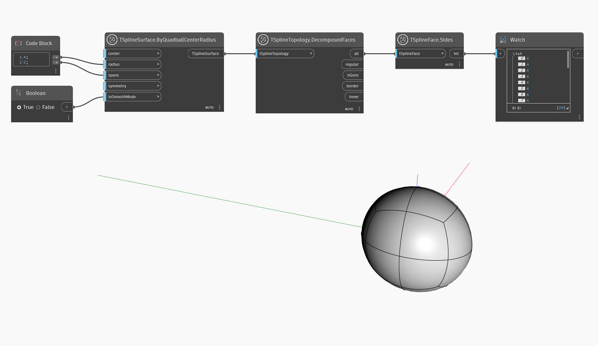

## In-Depth
Этот узел показывает количество сторон или ребер в каждой грани Т-сплайна.
В приведенном ниже примере узел `TSplineFace.Sides` используется для запроса количества сторон на всех гранях примитива тетрагональной сферы.

## Файл примера

