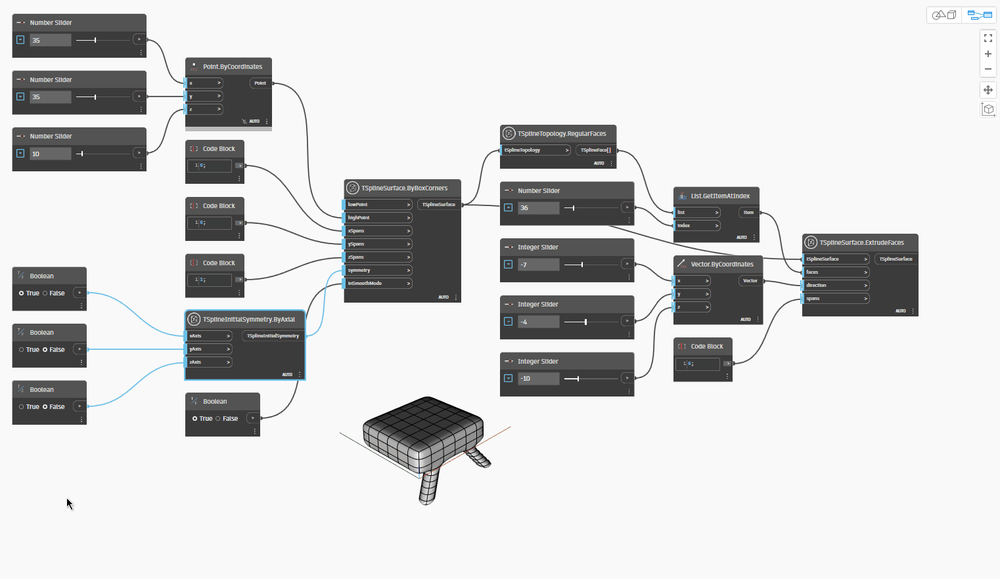

## Подробности
`TSplineInitialSymmetry.ByAxial` определяет, симметрична ли геометрия Т-сплайна вдоль выбранной оси (x, y, z). Симметрия может быть по одной, двум или всем трем осям. Симметрия, однажды заданная при создании геометрии Т-сплайна, влияет на все последующие операции и изменения.

В приведенном ниже примере узел `TSplineSurface.ByBoxCorners` используется для создания Т-сплайновой поверхности. Среди входных параметров этого узла используется параметр `TSplineInitialSymmetry.ByAxial` для определения исходной симметрии поверхности. Затем параметры `TSplineTopology.RegularFaces` и `TSplineSurface.ExtrudeFaces` используются для выбора и выдавливания грани Т-сплайновой поверхности соответственно. После этого операция выдавливания зеркально отражается вокруг осей симметрии, заданных с помощью узла `TSplineInitialSymmetry.ByAxial`.

## Файл примера

