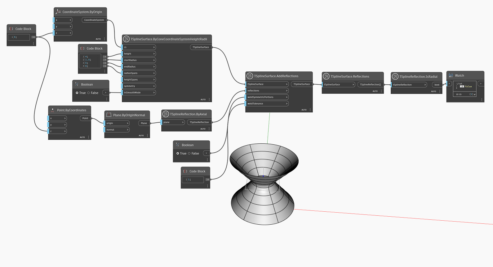

## In-Depth
Узел `TSplineInitialReflection.IsRadial` сообщает, является ли отражение Т-сплайна радиальным, возвращая значение True или False.

В приведенном ниже примере узел `TSplineSurface.Reflections` используется для получения списка отражений, примененных к объекту TSplineSurface. Затем узел `TSplineReflection.IsRadial` используется для проверки типа отражения: является ли оно радиальным (возвращает True) или осевым (возвращает False).

## Файл примера

