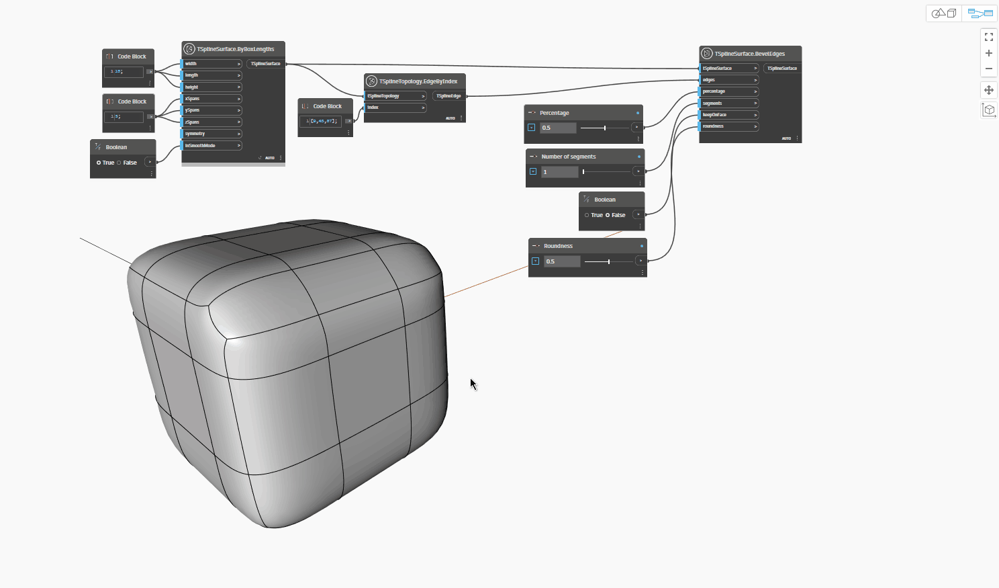

## In-Depth
Узел `TSplineSurface.BevelEdges` смещает выбранное ребро или группу ребер в обоих направлениях вдоль грани, заменяя исходное ребро последовательностью ребер, образующих швеллер.

В приведенном ниже примере группа ребер Т-сплайновой рамки-примитива используется в качестве входного параметра для узла `TSplineSurface.BevelEdges`. Пример иллюстрирует влияние следующих входных данных на результат:
— `percentage`: управляет распределением созданных ребер вдоль соседних граней. Если значения находятся ближе к нулю, новые ребра размещаются ближе к исходному ребру, а если ближе к 1 — дальше от него.
— `numberOfSegments`: задает количество новых граней в швеллере.
— `keepOnFace`: определяет, размещаются ли скошенные ребра в плоскости исходной грани. Если задано значение True, входной параметр округления не учитывается.
— `roundness`: управляет округлением скоса. Значение должно находиться в диапазоне от 0 до 1, при этом 0 дает прямой скос, а 1 — круглый.

Время от времени включается режим рамки для лучшего понимания формы.

## Файл примера

