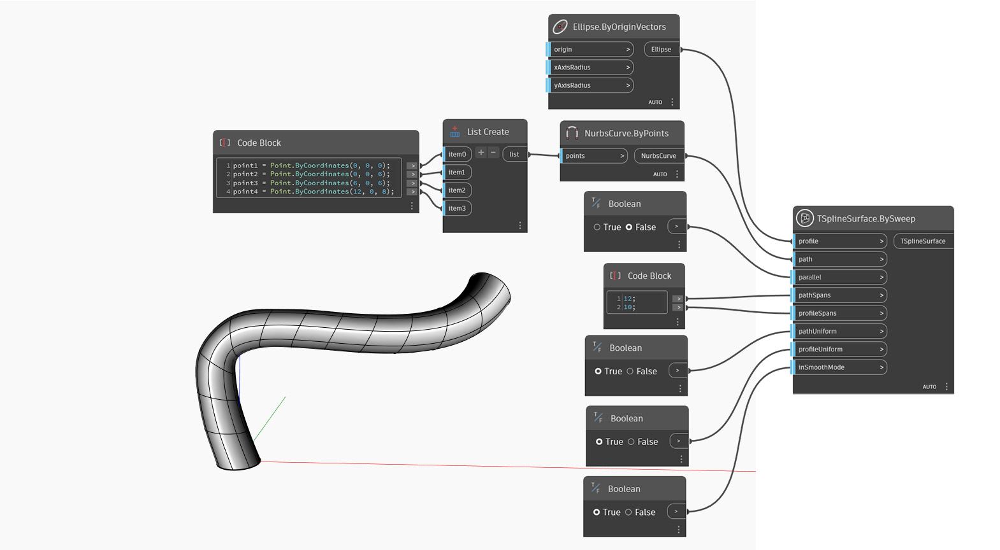

## Подробности
В приведенном ниже примере Т-сплайновая поверхность создается путем сдвига профиля (`profile`) относительно заданной траектории (`path`). Входной параметр `parallel` определяет, останутся ли пролеты профиля параллельными направлению траектории или будут вращаться вдоль нее. Определение формы задается с помощью параметров `pathSpans` и `radialSpans`. Входной параметр `pathUniform` определяет способ распределения пролетов траектории: равномерный или с учетом кривизны. Аналогичный параметр `profileUniform` управляет пролетами вдоль профиля. Исходная симметрия формы определяется входным параметром `symmetry`. Входной параметр `inSmoothMode` используется для переключения между режимами сглаживания и рамки для предварительного просмотра T-сплайновой поверхности.

## Файл примера

