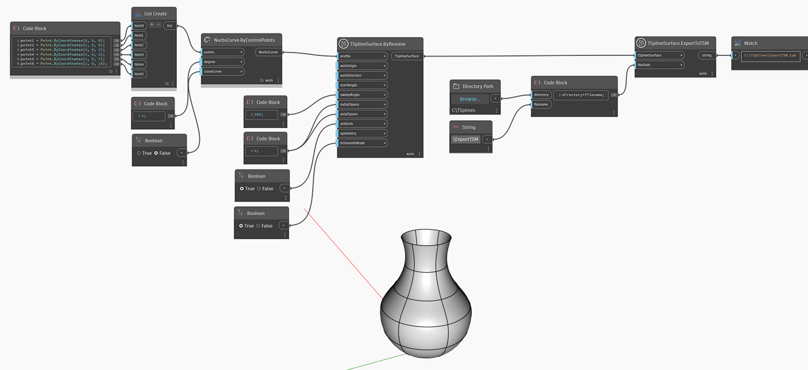

## Подробности
В приведенном ниже примере Т-сплайновая поверхность создается с помощью узла `TSplineSurface.ByRevolve`, при этом NURBS-кривая используется в качестве профиля.
При наличии пути к файлу поверхность экспортируется в файл T-Spline Mesh с помощью узла `TSplineSurface.ExportToTSM`.
___
## Файл примера

