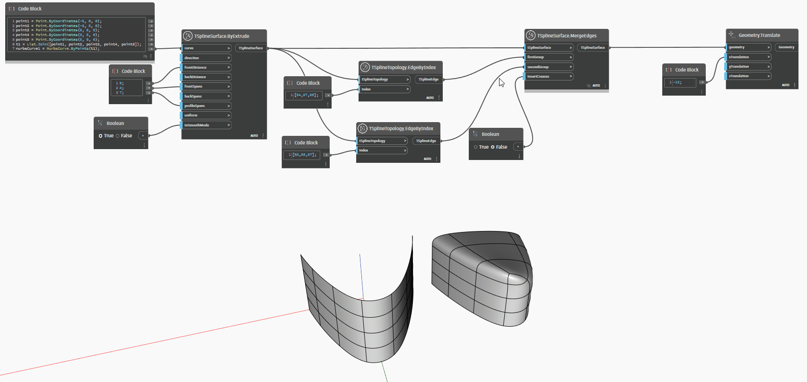

## Подробности
В приведенном ниже примере Т-сплайновая поверхность создается путем выдавливания NURBS-кривой. Шесть ее ребер выбираются с помощью узла `TSplineTopology.EdgeByIndex`: по три с каждой стороны формы. Два набора ребер вместе с поверхностью передаются в узел `TSplineSurface.MergeEdges`. Порядок групп ребер влияет на форму: первая группа смещается для объединения со второй группой, которая остается на месте. Входной параметр `insertCreases` позволяет выполнить сгиб шва вдоль объединенных ребер. Результат операции объединения смещается в сторону для удобства предварительного просмотра.
___
## Файл примера

